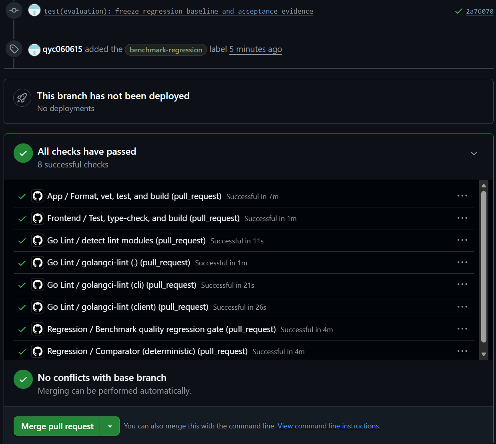
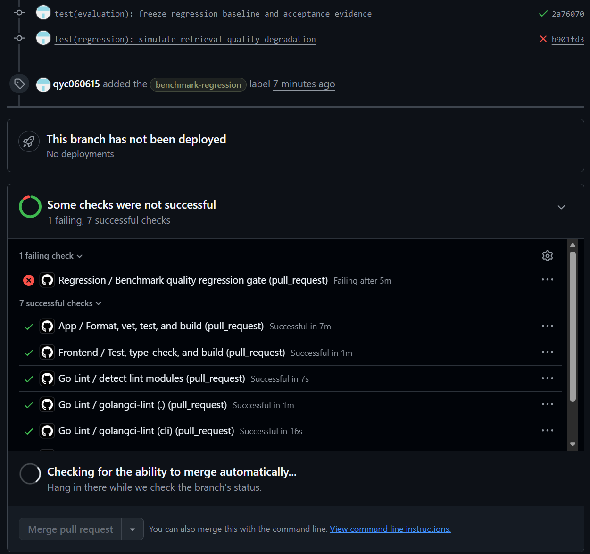
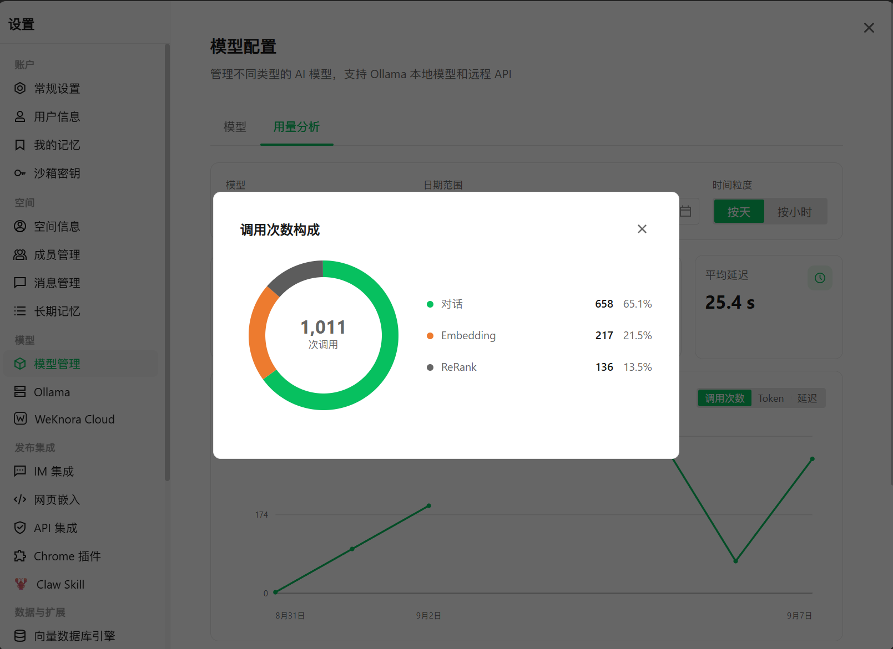
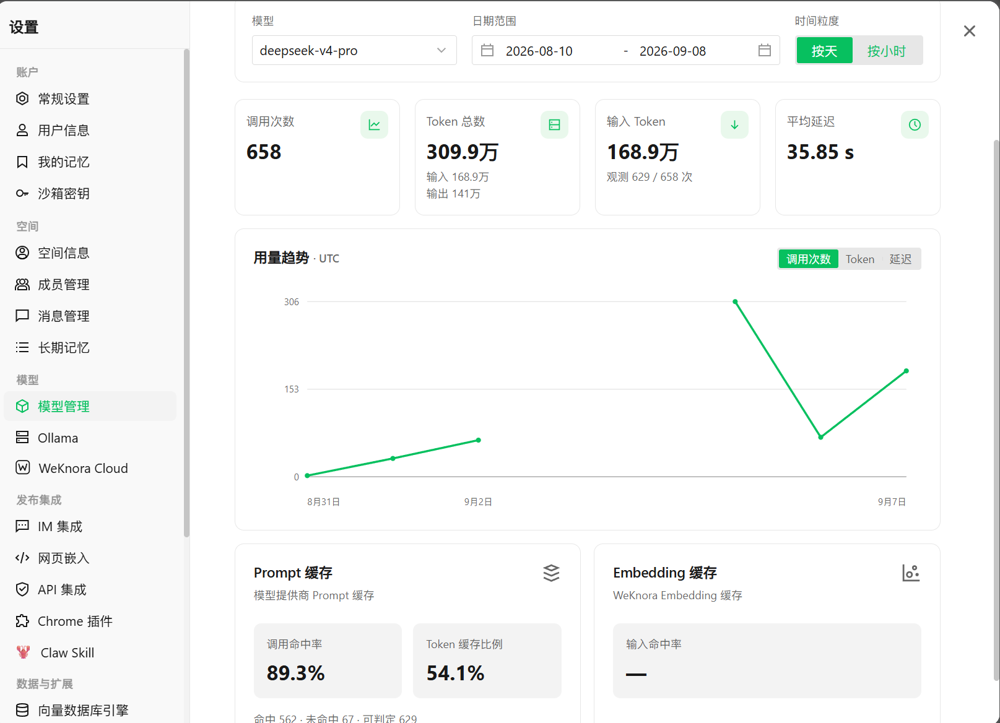
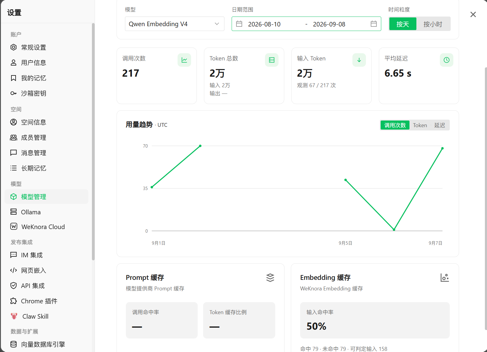

# WeKnora 犀牛鸟计划 2026 · 课题三成果说明

> **选题：** 质量评测基线与成本可观测（Topic 3）
> **仓库：** `qyc060615/WeKnora`

本文件集中说明课题三已完成的功能、核心实验结果、可视化成果与运行方式。

WeKnora 原项目的安装、部署与基础使用说明仍以仓库原有 `README.md` / `README_CN.md` 为准。

---

## 1. 完成情况

| 模块 | 状态 | 核心成果 |
|---|---|---|
| Evaluation 持久化 | ✅ 完成 | Evaluation 任务与结果持久化，支持任务状态、进度、运行标识和 12 项质量指标落库 |
| Benchmark v1.1 | ✅ 完成 | 固定数据集、模型、检索参数、生成参数和运行配置，建立可复现评测基线 |
| Unified Benchmark Result | ✅ 完成 | 将 Retrieval、Generation、运行配置与复现信息统一到同一结果结构 |
| Regression CI | ✅ 完成 | 正常代码真实 Benchmark 门控通过；真实 Retrieval 退化后 CI 自动识别指标回退并阻止合并 |
| Model Usage 可观测 | ✅ 完成 | Chat / Embedding / Rerank 统一记录 Calls、Provider Requests、Tokens、Latency 与 Cache 数据 |
| Model Usage Dashboard | ✅ 完成 | 提供模型筛选、时间范围、调用趋势、Token、Latency、Prompt Cache 与 Embedding Cache 统计 |
| Embedding Cache | ✅ 完成 | 相同文本 + 相同模型复用 Embedding，支持批量命中与 Redis Cache |
| Wiki Prompt Cache | ✅ 完成 | 调整 Prompt 组装顺序，稳定内容前置、变量内容后置，并完成真实 Cache 复用验证 |

---

## 2. 快速运行与测试

WeKnora 基础依赖、数据库、后端和前端启动方式沿用原项目 `README.md` / `README_CN.md`。

Benchmark 推荐通过项目提供的 Makefile wrapper 执行。Wrapper 会加载 `.env`，并设置 Benchmark 所需的运行环境，避免在新终端中直接执行 `go run` 时因环境变量未加载而失败。

### 2.1 Final Benchmark：Strict 模式

正式复现最终 Benchmark：

```bash
make benchmark-v1
```

如只需检查运行环境和冻结配置、不调用真实模型 Provider：

```bash
make benchmark-v1-preflight
```

Strict 模式要求当前环境与最终冻结的 Benchmark Contract 一致，包括：

- Dataset
- Embedding / Chat / Rerank 模型
- Retrieval / Generation 参数
- Embedding Cache 配置
- Worker Limit
- Runtime 环境

Preflight 通过后会标记：

```text
comparable_to_final_baseline=true
```

该模式用于正式复现 Final Benchmark，结果可与冻结 Baseline 直接比较。

### 2.2 Final Benchmark：Custom 模式

如果验收环境无法使用与最终实验完全一致的模型，可使用：

```bash
make benchmark-v1-custom
```

如只需进行 Preflight：

```bash
make benchmark-v1-custom-preflight
```

Custom 模式仍保留 Dataset、Runtime 和 Cache 等核心 Contract，但允许使用当前环境中的模型完成 Benchmark。

结果会标记：

```text
comparable_to_final_baseline=false
```

因此 Custom 模式用于验证完整 Benchmark Pipeline 可正常运行，但结果不与 Final Baseline 直接比较。

### 2.3 Regression Comparator

快速验证冻结的质量回归门控：

```bash
go run ./cmd/regression \
  --baseline config/regression/baseline.json \
  --current config/regression/current.json \
  --policy config/regression/policy.json
```

正常情况下应输出：

```text
Overall: PASS
```

该命令仅比较已有的 Baseline、Current BenchmarkResult 与 Regression Policy，不调用模型 Provider。

### 2.4 Tests

运行课题三相关自动测试：

```bash
go test -count=1 \
  ./internal/regression/... \
  ./cmd/regression/... \
  ./cmd/regression-benchmark/...
```

用于验证：

- Regression Comparator
- Benchmark Driver
- Strict / Custom Preflight
- Benchmark Contract
- Exit Code 行为

该命令不调用真实模型 API。

### 2.5 GitHub Regression Gate

真实 Regression Benchmark 已集成到 GitHub Actions。

普通 PR 默认运行 deterministic Comparator。

如需执行真实 Benchmark Quality Gate，为 PR 添加：

```text
benchmark-regression
```

label。

执行链：

```text
Current PR
→ Real Benchmark
→ Current BenchmarkResult
→ Regression Comparator
→ PASS / FAIL
```

当质量指标下降超过冻结阈值时，Workflow 返回非零 Exit Code，并阻止合并。

---

## 3. Benchmark v1.1

### 3.1 冻结评测配置

| 项目 | 配置 |
|---|---|
| Dataset | `benchmark_v1` |
| Benchmark Version | `v1.1` |
| Dataset Semantic SHA256 | `56fd363d797ee4c1524a5a1a2517b3b30ce955229c37784cf730c0d1dc47fd0d` |
| Corpus | 32 |
| Questions | 15 |
| Qrels | 15 |
| Answers | 15 |
| Embedding | `text-embedding-v4` |
| Embedding Dimension | 1024 |
| Chat | `deepseek-v4-pro` |
| Rerank | `qwen3-rerank` |
| Worker Limit | 27 |
| Embedding Cache | OFF |
| Vector Threshold | 0.2 |
| Keyword Threshold | 0.3 |
| Embedding TopK | 30 |
| Rerank TopK | 30 |
| Rerank Threshold | 0.3 |

[查看 Benchmark Dataset →](./dataset/benchmark_v1/)

[查看最终冻结配置 →](./config/benchmark/final_v1.json)

### 3.2 五次最终 Benchmark / 门控运行

本课题最终采用 **5 次 Benchmark / 验收运行** ：

| 次数 | 用途 | 结果 |
|---:|---|---|
| 1 | Final strict reproducibility Run 1 | 15/15 完成，12 项指标完整 |
| 2 | Final strict reproducibility Run 2 | 15/15 完成，12 项指标完整 |
| 3 | Final strict reproducibility Run 3 | 15/15 完成，12 项指标完整 |
| 4 | 正常代码真实 Regression CI Benchmark | Benchmark quality regression gate PASS |
| 5 | Retrieval degradation 真实 Regression CI Benchmark | 质量指标超过冻结阈值，gate FAIL，exit code 1 |

前三次用于验证冻结配置下的可复现性，后两次用于验证真实 CI 门控能够区分正常代码与质量退化代码。

### 3.3 Final strict 三次核心指标

| Metric | Run 1 | Run 2 | Run 3 |
|---|---:|---:|---:|
| Precision | 0.139003867 | 0.139003867 | 0.139003867 |
| Recall | 1.000000000 | 1.000000000 | 1.000000000 |
| NDCG@3 | 1.000000000 | 1.000000000 | 1.000000000 |
| NDCG@10 | 1.000000000 | 1.000000000 | 1.000000000 |
| MRR | 1.000000000 | 1.000000000 | 1.000000000 |
| MAP | 1.000000000 | 1.000000000 | 1.000000000 |
| BLEU-1 | 0.161878128 | 0.168613543 | 0.136987264 |
| BLEU-2 | 0.135830178 | 0.143252003 | 0.116281832 |
| BLEU-4 | 0.098042695 | 0.101756377 | 0.083091364 |
| ROUGE-1 | 0.282772802 | 0.306109408 | 0.255890639 |
| ROUGE-2 | 0.154857479 | 0.172751379 | 0.139054968 |
| ROUGE-L | 0.277034096 | 0.291294593 | 0.250074504 |

Final Regression baseline：

`eca1f236-0047-4fe3-aa11-39897e5d321b`


---
## 4. Regression CI 门控

Regression CI 由两层组成：

1. **Comparator (deterministic)**：每次 PR 运行，不调用模型 API，检查冻结 baseline、current fixture 与 threshold policy 的比较逻辑。

2. **Benchmark quality regression gate**：运行真实 Benchmark，将当前结果与冻结 baseline 比较；PR 添加 `benchmark-regression` label 后触发。

### 4.1 冻结阈值

| Metric | allowed_drop |
|---|---:|
| Precision | 0.020 |
| Recall | 0.020 |
| NDCG@3 | 0.020 |
| NDCG@10 | 0.020 |
| MRR | 0.020 |
| MAP | 0.020 |
| BLEU-1 | 0.030 |
| BLEU-2 | 0.025 |
| BLEU-4 | 0.020 |
| ROUGE-1 | 0.035 |
| ROUGE-2 | 0.020 |
| ROUGE-L | 0.035 |

比较规则：

```text
delta = current - baseline
PASS  = delta >= -allowed_drop
```

### 4.2 正常代码：真实门控通过

正常代码下，App、Frontend、Go Lint、deterministic comparator 与真实 Benchmark quality regression gate 全部通过。

<p align="center">

  
</p>
<p align="center"><sub>图 1：正常代码下真实 Benchmark quality regression gate 通过，全部检查成功。</sub></p>

### 4.3 Retrieval 退化：真实门控拒绝

在独立临时 PR 中引入真实 Retrieval quality degradation 后，普通工程检查继续通过，而 `Regression / Benchmark quality regression gate` 单独失败并阻止合并。

<p align="center">

  
</p>
<p align="center"><sub>图 2：真实 Retrieval 质量退化触发 Benchmark quality regression gate FAIL，CI 成功阻止合并。</sub></p>

Comparator 最终输出：

```text
12 quality metrics exceeded allowed regression threshold
exit status 1
```

---

## 5. Model Usage 可观测与可视化

Model Usage 页面位于：设置 → 模型管理 → 用量分析。

Model Usage Recorder 覆盖：

```text
Chat
Embedding
Rerank
   ↓
one row = one logical model invocation
   ↓
Model Usage Analytics API
   ↓
Model Usage Dashboard
```

支持统计：

- Calls
- Provider Requests
- Input / Output / Total Tokens
- Latency
- Prompt Cache Call Hit Rate
- Prompt Token Cache Ratio
- Embedding Cache Hit Rate

### 5.1 调用次数构成

当前统计数据中共记录 **1,011 次模型调用**：

- Chat：658 次
- Embedding：217 次
- ReRank：136 次

<p align="center">

  
</p>
<p align="center"><sub>图 3：Model Usage Dashboard 对 Chat、Embedding 与 ReRank 调用次数进行统一聚合展示。</sub></p>

### 5.2 Chat 模型用量与 Prompt Cache

`deepseek-v4-pro` 的 Dashboard 统计：

| 指标 | 数值 |
|---|---:|
| Calls | 658 |
| Total Tokens | 309.9 万 |
| Input Tokens | 168.9 万 |
| Output Tokens | 141 万 |
| Avg Latency | 35.85 s |
| Prompt Cache Call Hit Rate | 89.3% |
| Prompt Token Cache Ratio | 54.1% |

<p align="center">

  
</p>
<p align="center"><sub>图 4：`deepseek-v4-pro` 的调用次数、Token、Latency、调用趋势与 Prompt Cache 指标。</sub></p>

### 5.3 Embedding 模型用量与 Embedding Cache

`Qwen Embedding V4` 的 Dashboard 统计：

| 指标 | 数值 |
|---|---:|
| Calls | 217 |
| Total Tokens | 2 万 |
| Input Tokens | 2 万 |
| Avg Latency | 6.65 s |
| Embedding Cache Hit Rate | 50% |
| Cache Hits | 79 |
| Cache Misses | 79 |
| Eligible Inputs | 158 |

<p align="center">

  
</p>
<p align="center"><sub>图 5：Embedding 模型的调用趋势、Token、Latency 与 Embedding Cache 命中统计。</sub></p>

---

## 6. Embedding Cache

Embedding Cache 对以下调用生效：

- `Embed`
- `BatchEmbed`
- `BatchEmbedWithPool`

Cache Key 由模型配置指纹与文本 SHA-256 共同确定。

受控实验固定相同 32 个输入：

| 场景 | Cache Hits | Cache Misses | Provider Inputs | Provider Requests |
|---|---:|---:|---:|---:|
| OFF | 0 | 0 | 32 | 7 |
| COLD | 0 | 32 | 32 | 7 |
| WARM | 32 | 0 | 0 | 0 |

Warm Cache 下：

- 32/32 输入命中
- Provider Inputs：32 → 0
- Provider Requests：7 → 0

> **结果：** Warm Cache 下 32/32 输入命中，Provider Inputs 与 Provider Requests 均降至 0，实现相同文本与模型配置下的 Embedding 复用。

[查看历史实验原始数据 →](./artifacts/embedding_cache_v1/)

---

## 7. Wiki Prompt Cache

为提高 Provider Prompt Cache 的复用率，Wiki Prompt 组装方式调整为：

- 稳定的 instruction 内容前置
- 文档内容、slug 等变量内容后置

### 7.1 Historical BEFORE / AFTER

Historical BEFORE / AFTER 选取调用规模一致的 `wiki_summary` 层进行对比，用于验证 Prompt 结构调整对缓存复用的直接影响。

| Metric | Historical BEFORE | Historical AFTER |
|---|---:|---:|
| Eligible Calls | 8 | 8 |
| Cache Hits | 0 | 7 |
| Cache Misses | 8 | 1 |
| Input Tokens | 13,713 | 13,434 |
| Cache Read Tokens | 0 | 3,584 |
| **Call Hit Rate** | **0.00%** | **87.50%** |
| **Prompt Token Cache Ratio** | **0.00%** | **26.68%** |

> **结果：** `wiki_summary` 的 Call Hit Rate 从 **0% 提升至 87.5%**，Prompt Token Cache Ratio 从 **0% 提升至 26.68%**，验证了 Prompt 组装调整对缓存复用的提升效果。

[查看 Historical BEFORE / AFTER 原始数据 →](./artifacts/wiki_prompt_cache_v1/)

---

### 7.2 Final A / B 完整 Wiki 流程

在最终优化版本中，统计完整 Wiki 流程内所有可判定 Prompt Cache 状态的 `wiki_*` 模型调用，并通过两次独立运行验证最终实现。

| Metric | Final A | Final B |
|---|---:|---:|
| Eligible Calls | 59 | 59 |
| Cache Hits | 57 | 57 |
| Cache Misses | 2 | 2 |
| Input Tokens | 171,319 | 175,740 |
| Cache Read Tokens | 81,408 | 94,976 |
| **Call Hit Rate** | **96.61%** | **96.61%** |
| **Prompt Token Cache Ratio** | **47.52%** | **54.04%** |

> **结果：** 两次完整 Wiki 运行的 Call Hit Rate 均为 **96.61%**，Prompt Token Cache Ratio 为 **47.52% / 54.04%**，验证了最终版本在完整 Wiki 流程中的稳定缓存复用能力。

[查看 Final A / B 原始数据 →](./artifacts/rhino_2026_final/wiki_prompt_cache/ab/)

---

## 8. 最终验收结果

| 验收项 | 结果 |
|---|---|
| Benchmark v1.1 可复现执行 | ✅ PASS |
| 12 项质量指标统一输出 | ✅ PASS |
| Evaluation 结果持久化 | ✅ PASS |
| Regression Comparator | ✅ PASS |
| 正常代码真实 Benchmark Gate | ✅ PASS |
| Retrieval 退化触发 CI 拒绝 | ✅ PASS |
| Model Usage 记录 | ✅ PASS |
| Model Usage Dashboard | ✅ PASS |
| Embedding Cache | ✅ PASS |
| Wiki Prompt Cache | ✅ PASS |

---
